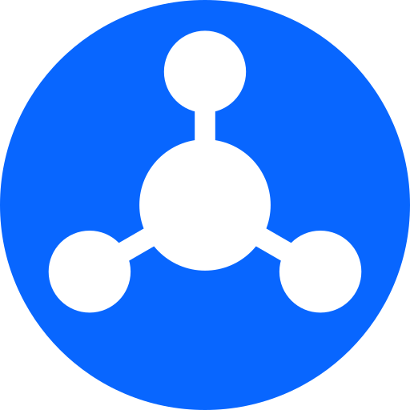

# Friend Focus

<p align="center">
  
</p>

<p align="center"><strong>A cleaner Facebook feed. You choose what you see — nothing else.</strong></p>

Friend Focus is a Chrome extension that cuts through Facebook's algorithmic noise by filtering your newsfeed to show only posts from people you actually follow as friends. No ads, no suggested posts, no pages you never subscribed to.


[](https://chromewebstore.google.com/detail/friend-focus/bglgckkcceoffcjkkgckkeeddckepmjn)

---

## What it does

Facebook's newsfeed is designed to surface content from pages, ads, and algorithmic recommendations — not necessarily the people you care about. Friend Focus intercepts the feed and hides everything that isn't from your curated friend list.

- Scans your Facebook friends, following list, and groups
- Filters the newsfeed in real time to show only those sources
- Lets you manage your list directly from the extension popup

## Features

- **Newsfeed filtering** — hides posts from non-friends as you scroll
- **Friend list sync** — automatically collects your Facebook friends
- **Following & group support** — optionally include accounts you follow or groups you're in
- **Popup UI** — view and manage your friend list without leaving Facebook
- **Import / export** — back up and restore your list as JSON

## Installation

There are two ways to install Friend Focus:

### Option 1 — Chrome Web Store (recommended)

Install directly from the [Chrome Web Store](https://chromewebstore.google.com/detail/friend-focus/bglgckkcceoffcjkkgckkeeddckepmjn) and click **Add to Chrome**.

### Option 2 — Load from source

1. Clone the repo and build:

   ```bash
   git clone https://github.com/PercyPham/friendfocus.git
   cd friendfocus
   pnpm install
   pnpm build
   ```

2. Open Chrome → `chrome://extensions/` → enable **Developer mode**
3. Click **Load unpacked** and select the `dist/` directory

## Development

**Prerequisites:** Node.js, [pnpm](https://pnpm.io/)

```bash
pnpm install   # install dependencies
pnpm dev       # start Vite dev server with HMR
```

Load the `dist/` directory as an unpacked extension in Chrome. The dev server supports hot reload for the popup UI; content scripts and the service worker require a manual extension reload after changes.

## Project structure

```
src/
├── background/          # Service worker — storage, RPC server
├── toolbar_action/
│   └── popup/           # React popup UI (Zustand state)
├── content_scripts/
│   ├── newsfeed/        # Newsfeed filtering logic
│   ├── friend_list/     # Friend list collection
│   ├── following_list/  # Following list collection
│   └── group_list/      # Group list collection
└── common/              # Shared types, contracts, storage utils
```

Modules communicate via a type-safe RPC contract defined in `src/common/background_contract/`. The background service worker acts as the server; popup and content scripts are clients.

## Tech stack

- [React 19](https://react.dev/) + TypeScript
- [Vite](https://vitejs.dev/) + [@crxjs/vite-plugin](https://crxjs.dev/vite-plugin)
- [Tailwind CSS v4](https://tailwindcss.com/)
- [Zustand](https://zustand-demo.pmnd.rs/)

## Contributing

Issues and pull requests are welcome. Please open an issue first for significant changes so we can discuss the approach.

## License

[MIT](./LICENSE) © 2026 Percy Pham
